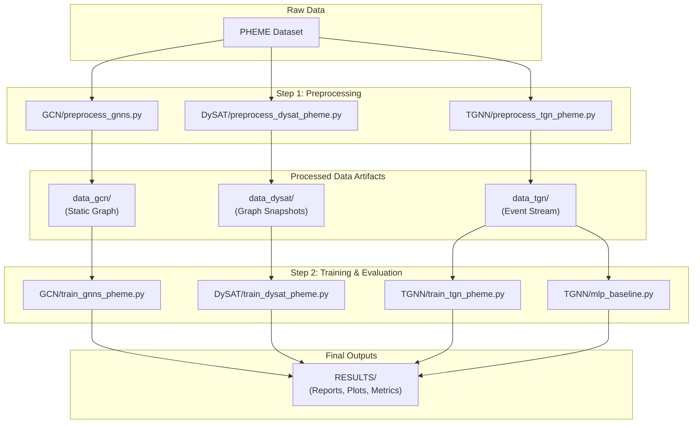

# Temporal Geometric Neural Networks for Rumour Detection

 
 
 

This repository contains the full source code and manuscript for the thesis, _"Temporal Geometric Neural Networks for Rumour Detection: Architectures, Applications, and Temporal Nuance."_ The research provides a systematic evaluation of static and temporal Graph Neural Networks (GNNs) for detecting rumours in social media conversation threads, using the PHEME dataset as a benchmark.

## Project Overview

The core of this work is a controlled, head-to-head comparison of six models—from a simple MLP baseline to static GNNs (GCN, GAT, GATv2) and advanced temporal GNNs (DySAT, TGN). By using a unified experimental framework, the study isolates the impact of model architecture on performance, providing clear insights into the value of temporal reasoning for this task.

### Key Features
*   **Systematic Comparison:** A rigorous, head-to-head evaluation of six distinct graph-based architectures on an identical benchmark.
*   **Unified Experimental Framework:** All models are trained using the same data splits, feature representations (BERT embeddings), and evaluation protocols to ensure fair and reproducible comparisons.
*   **Targeted Ablation Studies:** The research specifically investigates the contribution of temporal self-attention in snapshot-based models (DySAT) and analyzes the performance of continuous-time models (TGN) on sparse social media data.
*   **In-depth Analysis:** The evaluation extends beyond aggregate metrics to include analysis of training dynamics, error patterns (confusion matrices), and the geometric properties of learned embedding spaces (t-SNE).

> ### Abstract
>
> Rumour detection on social media hinges on recognising *how* information propagates, not merely *what* is said. To probe the role of temporal dynamics, we benchmark six graph-based neural models on the PHEME Twitter corpus: static GCN, GAT, GATv2, and three dynamic variants—DySAT, a simplified DySAT without temporal self-attention, and the continuous-time Temporal Graph Network (TGN). Results show that temporal self-attention is valuable but not transformative: full DySAT edges out its aggregation-only ablation by roughly 3 percentage points in macro-F1, confirming that fine-grained time weighting helps but that much of the signal is already captured by simpler temporal aggregation. By contrast, TGN fails to surpass even our static graph baseline, suggesting that its memory-update mechanism is ill-suited to PHEME’s sparse, subtle temporal cues. Among static methods, GATv2 delivers a consistent yet modest improvement over GAT, illustrating the benefit of more expressive attention even without explicit temporal modelling. Qualitative assessments of t-SNE projections further reveal that temporal models carve cleaner rumour/non-rumour clusters than static ones, underscoring a geometric advantage. Collectively, these findings indicate that effective rumour detection benefits from architectures that embed temporal reasoning directly, while also cautioning that not all continuous-time designs transfer cleanly to real-world social datasets.

---

## Key Findings

The results demonstrate a clear and significant performance improvement when incorporating temporal dynamics. DySAT, with its dual structural-temporal attention mechanism, emerged as the top-performing model.

**Table 1: Average Macro F1-Score Across All PHEME Events**

| Model Family | Model | Average F1-Score |
| :--- | :--- | :--- |
| **Baseline** | MLP Baseline | 0.7187 |
| **Static GNNs** | GCN | 0.7443 |
| | GAT | 0.7753 |
| | GATv2 | 0.7730 |
| **Temporal GNNs** | TGN | 0.7661 |
| | SimpleDySAT (Ablation) | 0.7935 |
| | **DySAT (Full)** | **0.8709** |

*Note: Results are derived from Table 5.1 in the thesis manuscript.*

---

## Repository Structure

The codebase is organized by model architecture, with dedicated scripts for preprocessing and training.

```
Thesis/
├── .gitignore
├── DySAT/
│   ├── preprocess_dysat_pheme.py      # Preprocessor for DySAT (creates time-windowed snapshots)
│   ├── train_dysat_pheme.py           # Main DySAT trainer with full ablation workflow
│   └── train_dysat_pheme_SIMPLIFIED.py# Simplified DySAT trainer for the ablation study
├── GCN/
│   ├── preprocess_gnns.py             # Preprocessor for all static GNNs
│   ├── train_for_animation.py         # Special trainer to save embeddings for visualization
│   └── train_gnns_pheme.py            # Main trainer for GCN, GAT, and GATv2
├── TGNN/
│   ├── mlp_baseline.py                # Trainer for the non-graph MLP baseline
│   ├── preprocess_tgn_pheme.py        # Preprocessor for TGN (creates continuous event streams)
│   ├── train_tgn_pheme.py             # Main TGN trainer with full ablation workflow
│   └── train_tgn_pheme_no_ablation.py # Simplified TGN trainer (less comprehensive)
└── figures/
    ├── rumour_timeline.tex            # LaTeX source for Figure 2.1
    └── static_vs_temporal.tex         # LaTeX source for Figure 2.2
```
---

## Experimental Workflow

The project follows a two-stage process: data preprocessing tailored to each model family, followed by a comprehensive training and evaluation pipeline.



### 1. Prerequisites

*   **Python 3.8+**
*   **PyTorch 1.12+**
*   A **CUDA-enabled GPU** is strongly recommended for feasible training times.
*   The **PHEME dataset** of rumourous and non-rumourous tweet threads. This dataset must be acquired separately and placed in a local directory (e.g., `PHEME/`).

### 2. Installation

1.  **Clone the repository:**
    ```bash
    git clone <repository-url>
    cd Thesis
    ```

2.  **Create and activate a virtual environment:**
    ```bash
    python -m venv venv
    source venv/bin/activate  # On Windows: venv\Scripts\activate
    ```

3.  **Install dependencies:**
    The following commands install the core packages. Please adjust the CUDA version (`cu116`) to match your system's configuration.
    ```bash
    # Install PyTorch
    pip install torch torchvision torchaudio --extra-index-url https://download.pytorch.org/whl/cu116

    # Install PyTorch Geometric and its dependencies
    pip install torch-scatter torch-sparse torch-cluster torch-spline-conv torch-geometric -f https://data.pyg.org/whl/torch-1.12.0+cu116.html

    # Install other required packages for training and analysis
    pip install transformers pandas numpy scikit-learn tqdm matplotlib optuna kaleido
    ```

### 3. Data Preprocessing

Run the appropriate script for the model family you wish to evaluate.

*   **Static GNNs (GCN, GAT, GATv2):**
    Generates a single, time-aggregated graph for each event.
    ```bash
    python GCN/preprocess_gnns.py --data-dir /path/to/PHEME --output-dir data_gcn
    ```

*   **DySAT (Snapshot-based):**
    Generates a sequence of cumulative graph snapshots for each event.
    ```bash
    python DySAT/preprocess_dysat_pheme.py --data-dir /path/to/PHEME --output-dir data_dysat
    ```

*   **TGN and MLP (Continuous-time):**
    Extracts a continuous stream of timestamped interaction events.
    ```bash
    python TGNN/preprocess_tgn_pheme.py --data-dir /path/to/PHEME --output-dir data_tgn
    ```

### 4. Training and Evaluation

The training scripts are designed to run a full hyperparameter search and evaluation workflow using Optuna. Results are saved in a structured `RESULTS/` directory.

*   **Static GNNs (GCN, GAT, GATv2):**
    Runs an Optuna study for each specified architecture and generates an aggregated report.
    ```bash
    python GCN/train_gnns_pheme.py --data-dir data_gcn --archs gcn gat gatv2 --optuna-trials 50
    ```

*   **DySAT and its Ablation:**
    Executes the complete workflow, including hyperparameter tuning, evaluation of the full and ablated models, and report generation.
    ```bash
    python DySAT/train_dysat_pheme.py --data-dir data_dysat --run-full-ablation --optuna-trials 30
    ```

*   **TGN:**
    Finds optimal hyperparameters on the combined dataset and uses them to evaluate performance on individual events.
    ```bash
    python TGNN/train_tgn_pheme.py --base_data_dir data_tgn --run-optuna --generate_aggregated_report --n_trials 30
    ```

---

## Connecting Code to the Thesis Manuscript

The table below maps key sections of the thesis to their corresponding implementations in the codebase.

| Thesis Section/Chapter | Relevant Code | Description |
| :--- | :--- | :--- |
| **Chapter 4: Methodology** | `preprocess_*.py` | Implements the data conversion from raw PHEME to graph structures. |
| | `train_*.py` (model classes) | Defines the GCN, GAT, DySAT, and TGN architectures as PyTorch modules. |
| | `train_*.py` (training loops) | Contains the training, validation, and testing logic, including Optuna integration. |
| **Chapter 5: Results** | `RESULTS/` (output dir) | All quantitative results, tables, and figures are generated by the training scripts. |
| | `train_for_animation.py` | A specialized script used to generate the embeddings for the t-SNE visualizations. |
| **Ablation Study (RQ2)** | `DySAT/train_dysat_pheme.py` | Contains the logic to train both the full DySAT model and its simplified variant. |

---

## Citation

If you use this codebase or refer to the findings in your own research, please cite the thesis:

```bibtex
@phdthesis{haskins2025temporal,
  author       = {Matthew Haskins},
  title        = {Temporal Geometric Neural Networks for Rumour Detection: Architectures, Applications, and Temporal Nuance},
  school       = {The University of Western Australia},
  year         = {2025},
  month        = {May},
  note         = {Supervisor: Dr. Jin Hong}
}
```

## License

This project is licensed under the MIT License. See the `LICENSE` file for details.
